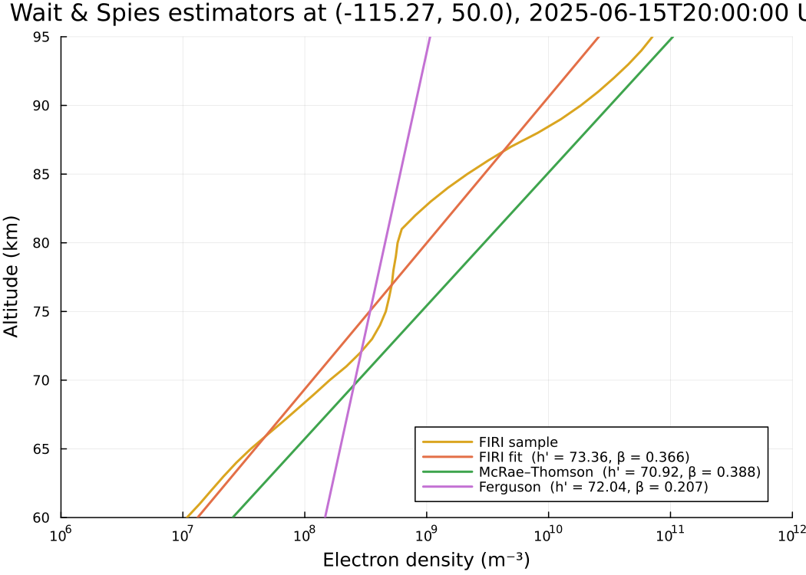

# WaitProfileEstimators.jl

Estimators for the two-parameter Wait & Spies exponential model of the
D-region electron density profile, given a geographic location and a UTC
datetime. The model is

```math
N_e(z) = 1.43 \times 10^{13}\, \exp(-0.15\,h') \, \exp\!\big[(\beta - 0.15)(z - h')\big]
\quad [\mathrm{m}^{-3}],
```

with altitude `z` and reference height `h'` in km and sharpness `β` in
km⁻¹, in the convention used by
[LongwaveModePropagator.jl](https://github.com/fgasdia/LongwaveModePropagator.jl).

Three independent estimation methods are provided:

- **`FIRIFit`** — least-squares fit of `(h', β)` to a
  [FIRI](https://github.com/fgasdia/FaradayInternationalReferenceIonosphere.jl)
  (Faraday International Reference Ionosphere) electron density profile
  sampled at the given location and time.
- **`McRaeThomson`** — daytime midlatitude polynomial fits in signed
  solar zenith angle, after McRae & Thomson (2000).
- **`Ferguson`** — empirical fit of `(h', β)` to geographic latitude,
  solar zenith angle, and month, after Ferguson (1980).

## Installation

The package is not yet in Julia's General registry. Install from GitHub:

```julia
using Pkg
Pkg.add(url = "https://github.com/JamesMCannon/WaitProfileEstimators.jl")
```

## Quick start

```julia
using WaitProfileEstimators
using Dates

lola = (-115.27, 50.00)              # (lon_deg, lat_deg)
dt   = DateTime(2025, 6, 15, 20, 0)  # UTC

hprime_beta(FIRIFit(),      lola, dt)   # → (h', β)
hprime_beta(McRaeThomson(), lola, dt)
hprime_beta(Ferguson(),     lola, dt)

# Symbol-form convenience:
hprime_beta(lola, dt; method = :firi)
```

## Conventions

| Quantity                | Unit / form                          |
|-------------------------|--------------------------------------|
| Location                | `(lon_deg, lat_deg)` tuple, east-positive longitude |
| Datetime                | `Dates.DateTime` in UTC (UT1)        |
| Altitude (input/output) | metres for `waitprofile`; km for `h'` |
| Reference height `h'`   | km                                   |
| Sharpness `β`           | km⁻¹, Wait / LongwaveModePropagator convention |
| Solar zenith angle      | degrees (internal); McRae–Thomson uses signed radians, AM negative |

## Comparing the three methods

A short example that overlays each estimator's Wait & Spies profile on
the underlying FIRI sample at a single location and time. Requires
`Plots` in your local environment.

```julia
using WaitProfileEstimators
using FaradayInternationalReferenceIonosphere
import FaradayInternationalReferenceIonosphere as FIRI
using Dates, Plots

lola = (-115.27, 50.00)
dt   = DateTime(2025, 6, 15, 20, 0)

# FIRI sample on its native altitude grid (m → km for plotting).
# (FIRI's southern-hemisphere mirroring is handled internally by FIRIFit;
# this direct sample assumes a northern-hemisphere point.)
chi = WaitProfileEstimators.zenithangle(lola[2], lola[1], dt)
ne_firi = firi(chi, lola[2]; month = month(dt))
z_km    = FIRI.ALTITUDE ./ 1000

# h' and β from each method.
hpβ = Dict(
    "FIRI fit"      => hprime_beta(FIRIFit(),      lola, dt),
    "McRae-Thomson" => hprime_beta(McRaeThomson(), lola, dt),
    "Ferguson"      => hprime_beta(Ferguson(),     lola, dt),
)

# Plot.
plt = plot(xaxis = :log, xlims = (1e6, 1e12), ylims = (60, 95),
           xlabel = "Electron density (m⁻³)", ylabel = "Altitude (km)",
           legend = :bottomright)
plot!(plt, ne_firi, z_km, label = "FIRI", lw = 2, color = :goldenrod)

zgrid = 60_000:100:95_000
for (name, (hp, β)) in hpβ
    plot!(plt, waitprofile(zgrid, hp, β), zgrid ./ 1000;
          label = "$name  (h' = $(round(hp; digits=2)) km, β = $(round(β; digits=3)) km⁻¹)",
          lw = 2)
end
plt
```



## Method validity

All three methods assume geomagnetically quiet conditions; for perturbed
conditions (geomagnetic storms, solar flares, solar particle events) the
returned `(h', β)` should be treated as the unperturbed baseline only.
`FIRIFit` accepts an `f10_7` keyword that lets the user select a solar-flux
range as a proxy for solar-cycle phase, but this is distinct from
geomagnetic disturbance and does not extend the methods to perturbed
conditions. Each estimator has a regime where it is on solid empirical
ground:

- `FIRIFit` inherits the validity of FIRI-2018 itself: **nonauroral**
  conditions, latitudes 0°–60° (with linear extrapolation beyond), solar
  zenith angle 0°–130°, in the altitude window set by `zrange_km`
  (default 60–90 km, the range over which FIRI is considered reliable).
  Southern-hemisphere inputs are mirrored across the equator and shifted
  six months internally, per Friedrich et al. (2018). See
  [FaradayInternationalReferenceIonosphere.jl](https://github.com/fgasdia/FaradayInternationalReferenceIonosphere.jl)
  for details of the underlying model and its inputs.
- `McRaeThomson` is a daytime midlatitude fit calibrated near solar
  minimum; it is valid for `|χ| ≲ 98°` with increasing validity closer to midday.
- `Ferguson` was developed for the U.S. Navy's long-wavelength
  propagation assessment programs (Ferguson 1980; Ferguson & Snyder
  1990); the underlying report is titled for nighttime VLF/LF
  prediction, but the polynomial takes `cos(χ)` as an input and is in
  practice used across day and night. The implementation here omits the
  higher-order sunspot-number and magnetic-absorption terms of the
  original report.

Choose the method appropriate to the regime of interest.

## References

- Ferguson, J. A. (1980). *Ionospheric profiles for predicting nighttime
  VLF/LF propagation* (Tech. Rep. NOSC/TR-530). Naval Ocean Systems Center.
- Ferguson, J. A., & Snyder, F. P. (1990). *Computer programs for
  assessment of long wavelength radio communications, version 1.0:
  Full FORTRAN code user's guide* (NOSC TD-1773). Naval Ocean Systems Center.
- Friedrich, M., Pock, C., & Torkar, K. (2018). FIRI-2018, an updated
  empirical model of the lower ionosphere. *Journal of Geophysical
  Research: Space Physics*, 123(8), 6737–6751.
  https://doi.org/10.1029/2018JA025437
- Grena, R. (2012). Five new algorithms for the computation of sun
  position from 2010 to 2110. *Solar Energy*, 86(5), 1323–1337.
  https://doi.org/10.1016/j.solener.2012.01.024
- McRae, W. M., & Thomson, N. R. (2000). VLF phase and amplitude:
  daytime ionospheric parameters. *Journal of Atmospheric and
  Solar-Terrestrial Physics*, 62(7), 609–618.
  https://doi.org/10.1016/S1364-6826(00)00027-4
- Wait, J. R., & Spies, K. P. (1964). *Characteristics of the Earth-ionosphere
  waveguide for VLF radio waves* (NBS Tech. Note 300). U.S. National
  Bureau of Standards.

## Acknowledgments

The `Ferguson` implementation and the Grena (2012) solar-position
algorithm used by `zenithangle` were ported from
[LMPTools.jl](https://github.com/fgasdia/LMPTools.jl) by Forrest Gasdia.
Use of these routines here is gratefully acknowledged.

## License

MIT — see [LICENSE](LICENSE).

## Citing this package

If you use WaitProfileEstimators.jl in published work, please cite the
methods you used (Ferguson 1980, McRae & Thomson 2000, and/or
Friedrich et al. 2018) and, optionally, this package:

```bibtex
@software{WaitProfileEstimators_jl,
  author = {Cannon, James M.},
  title  = {WaitProfileEstimators.jl: Estimators for Wait \& Spies
            D-region profile parameters},
  url    = {https://github.com/JamesMCannon/WaitProfileEstimators.jl},
  year   = {2026},
}
```